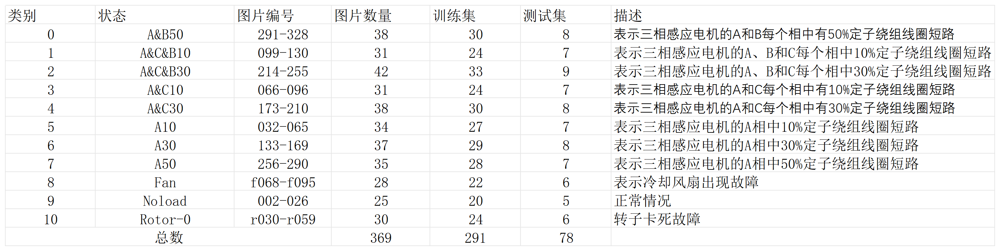
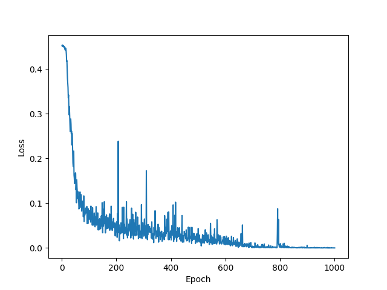
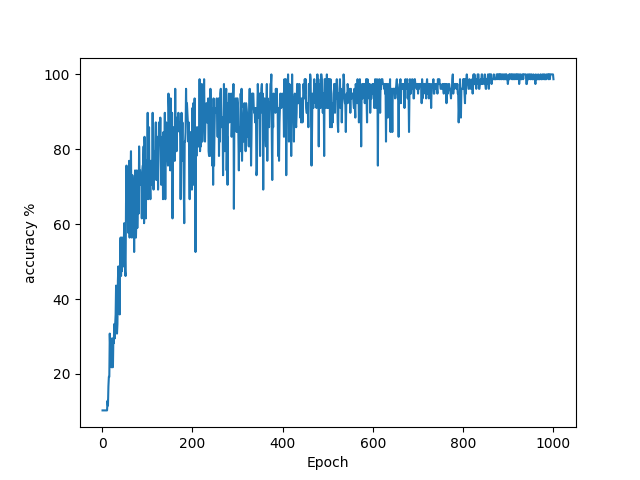

# Image_Recognition

## Python语言设计与实践 第三次项目

[](https://www.python.org/)

### 需求

利用老师发的感应电机红外图像数据集，通过卷积神经网络实现图像的分类，同时运行出效果图

### 环境

`python` 版本:3.11

### 快速开始

```
pip install -r requirements.txt

python cnn.py
```

### 实现思路

- 本项目主要是基于 `Pytorch` 框架进行卷积神经网络训练模型，版本为2.3.0


- 首先进行数据处理，打上相应的标签。将369张图像进行测试训练二八分，分别存在 `Dataset/train` 和 `Dataset/test` 下，然后<br/>
  根据类别各自命名，通过名字来实现手动分类，以下是分类的一些说明图：


- 然后由于图像数量较少，这里做了一些数据增强，在 `load_data` 中对图像做了随机的水平和垂直翻转，同时对三个颜色通道都做了<br/>
归一化处理，然后将处理好的数据导入神经网络中


- 卷积神经网络的核心部分主要分为三个，我们设计了三个卷积层和三个全连接层，同时池化层的规格是2x2，每次实现的时候都用激活函数<br/>
`relu` 做激活，最后一层全连接函数不用激活


- 另外，我们也设置了随机种子，来保证结果的可重复性；设置的 `device` 变量也可以自动检测运行机器有没有合适的GPU，<br/>
如果有则使用GPU运行，否则使用CPU


- 最后实现训练函数和测试函数，将学习率设置为0.001，训练1000轮，同时画出损失函数和准确率函数的曲线，如图：<br/>
  
  


- 可以看到整体曲线非常符合曲线函数，同时到最后，损失趋近于0，且准确率趋近于100%


- 一些反思：根据我们现有对模型训练的理解，损失接近0和准确率达到100%是非常非常少见的事情，然后我们下来查阅了相关资料<br/>
发现我们所用的数据集数量确实太少，所以是有可能达到这种非常理想的情况的

### 改进

- 由于一般模型训练都是对训练集和测试集八二分，所以在保证学习率和训练轮次的情况下，<br/>
我们做了一个训练集测试集分别是五五分、六四分、七三分、八二分、九一分的实现，进行改进升级


- 同时，由上述的训练和测试结果可以看到，曲线虽然有整体趋势，但是并不光滑，中间有几次比较大的跳动，所以我们也对曲线的绘制<br/>
进行了平滑处理，也给图像上的曲线不同颜色打上标签，进行损失和准确率的对比，平滑处理我们主要采用了五种方法，分别对比一下：

**简单平均移动** 
<br/>
<br/>

**指数平均移动** 
<br/>
<br/>

**高斯滤波平滑** <br/>
<br/>
<br/>

**中位数滤波平滑** <br/>
<br/>
<br/>

**局部加权回归平滑** 

### 总结

最后根据图像分析，结合平滑程度和整体趋势，可以看出高斯滤波平滑的效果最好

##### 损失图像


##### 准确率图像


最后根据数据集的样本数量以及训练集与测试集比例的不同，综合可视化的图像来分析，可以明显看出训练测试比例为9:1的时候效果最好，<br/>
而5:5的时候效果最差，其余三个在中间有不同程度的跳跃，但是整体都是呈现出曲线函数的趋势

### 小组成员

Lin Xiaoyi, Tang Jiajun, Wang Zhen, Chen Guanrui, Wang Jing

### 此项目仅供学习交流使用，转载请注明出处！
